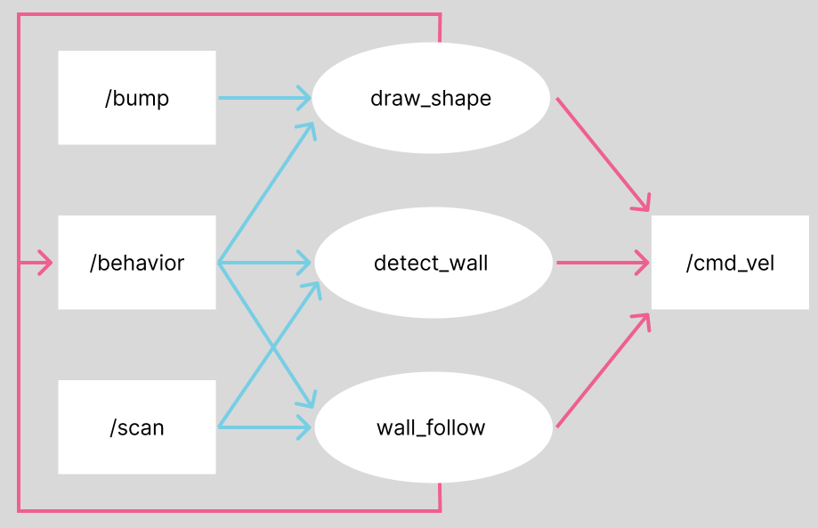
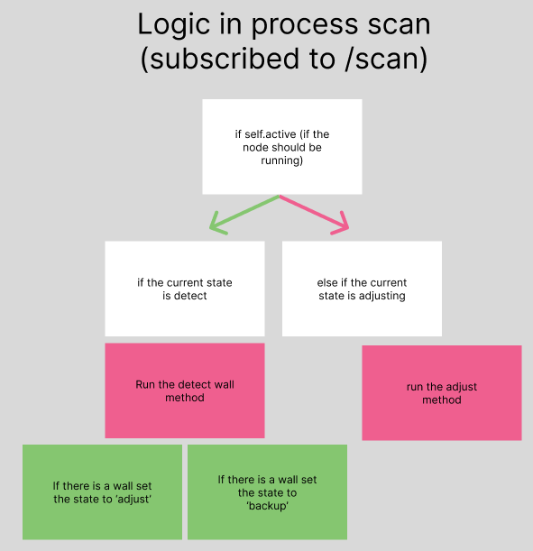
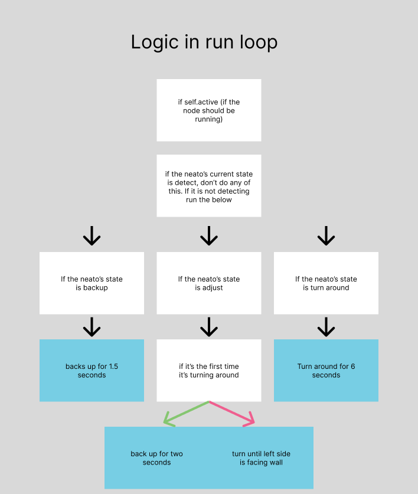

# Computational Robotics Finite State Machine Project

ENGR3590: A Computational Introduction to Robotics, Olin College of Engineering, FA2026

Siddhant Kulkarni, Trevor McDonald

This is an introductory project that explores how to create how to use nodes, subscriptions, and publishers to control a neato. Our neato implements three behaviors:

- Draw Shape
- Wall Detect
- Wall Follow

## Draw Shape
The draw shape behavior tells the neato to draw a shape based on a set number of turns, and given angle.
### Methods
This iteration of draw_shape.py draws a star. The number of turns is set to 5 and the angle is set at 144 degrees. To prevent the neato from continuing to run after bumping into something we subscribe to the "/cmd_vel" topic and use multi-threading. Since we are using sleep to make the neato drive forward and turn, we need to use multi-threading to interrupt the command. We use an Event to execute this interrupt. Although in code and in simulation our code draws a star, when we use the actual neatos they do not. The real neatos exhibit factors like friction that make the number of degrees to turn impossible to be accurate using time. To ensure accurate turnings we would have to be odometry, but since the purpose of draw shape is to find a wall to bump into, we determined that drawing an accurate star was not necessary.

### Code Structure
The code structure of this method definitely leaves something to be desired. Building this method was our first time interacting with the real world neatos and there was lots of stuff that was added along the way. An example of the architecture that should change is that the distance is predetermined on initialization, whereas the angle is determined when calling the function "turn_left."

A design choice we made to connect all the behaviors was not to create a separate finite state machine node that controls everything, instead we created a topic that allowed the nodes to communicate with each other. The topic 'behavior' has three possible string states: `DRAW_SHAPE`, `DETECT_WALL`, `WALL_FOLLOW`and it's a topic that all nodes both subscribe and publish to. Using hand_off and process_behavior methods that are present in each behavior, the nodes tell each other when to run and when to be publishing to `/cmd_vel` or publishing to `/scan` or `/bump`.

## Wall Detect
The wall detect behavior helps a neato decide if what it bumps into is a wall, or if it's some other object. From there it hands it off to another behavior.
### Methods
The way we checked if what the neato ran into was a wall was by using the LIDAR sensor. The first thing it does is go through each index on the LIDAR sensor to find the shortest distance to the wall. When it finds the shortest distance, it takes the index 30 degrees to the left and 30 degrees to the right of the minimum distance and sees if they are equal. Due to the possible error in the neato LIDAR sensors, we make the error 0.2 meters. We found that although this is a large error amount it is okay for the actual neatos as if it's not bumping to the wall at least one of the readings will read "inf." After detecting a wall, a neato configures itself by aligning its left side (index 90) with the wall. We do this as our code for wall follow only works if the neato is on its left side.

### Code Structure
This behavior is the only one of our nodes that can hand off to either of the other two nodes. This makes for some complex if-elif-else logic on our end that works out exactly what we want the neato to do. When originally mapping this out, we forgot to consider that we would want the neato to back up not just if it was returning to draw shape, but it was handing off to wall follow as well. To solve this we added a physical backup in the if-elif logic instead of encorporating back up in the same way if it's returning to draw shape.

The reason there are two if logic chains instead of just one has to do with how they publish and subscribe to information. process_scan is subscribed to the LIDAR data has control over the current state and calls other methods. The logic in run_loop on the other hand relys on the state information from process_scan to decided what information to publish to the neato's motors.

## Wall Follow
Wall follow is the most straight forward of our behaviors. It moves along the right-side of anything it determins to be a wall.

### Methods
Wall follow works by taking the index 30 degrees less and 30 degrees more than the index that represents left on the neato (90). It calculates the distances of each of these and tries to make them the same at all times. 

### Code Structure
Wall follow is able to continuously follow a wall thanks to the `turn_state` variable. This is done with some basic if-elif-else logic where if the length of a is greater than b it will turn towards the wall, if b is greater than a it will turn away from the wall, and otherwise it will just drive forward.

## Conclusion
### Challenges
Boy oh boy were there challenges. One of the biggest challenges we faced was towards the end when we had all of our individual behaviors and we were trying to combine them into a finite state machine. We opted to not go for a single node approach, and instead built a separate topic that all nodes could subscribe and publish to. More information about this is listed in Draw shape. This was not easy, and this led to some very haphazard if else logic that took forever to debug. This leads to another major challenge we faced: debugging. I think one reason this was difficult is that we didn't take advantage of all of the debugging tools that ros has to offer. We never used rviz2, and looked at the node graph maybe once to help us out.
### Improvements
A huge improvement we would implement if we did this again is to try to do the whole FSM inside of one node instead of publishing to our behavior topic. This would make desync between the nodes much easier to deal with and the communication between them much less cumbersome. This is especially relavent since other than detecting if a bump has occured, none of the behaviors have to happen at the same time as each other.

### Takeaways
From this project